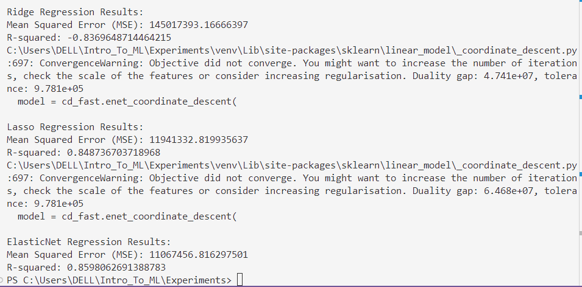

# Implementation of Ridge, Lasso, and ElasticNet Regularization for Predicting Car Price

## AIM:
To implement Ridge, Lasso, and ElasticNet regularization models using polynomial features and pipelines to predict car price.

## Equipments Required:
1. Hardware – PCs
2. Anaconda – Python 3.7 Installation / Jupyter notebook

## Algorithm

#### 1. Import Libraries

* Import pandas for data handling, scikit-learn for preprocessing, modeling, and evaluation.
#### 2. Load Dataset

* Load the dataset from encoded_car_data.csv.
#### 3. Select Features and Target

* Separate features (X) and target (y) for the model.
#### 4. Split Dataset

* Divide data into training and testing sets (80-20 ratio).
#### 5. Define Models and Pipelines

* Create pipelines for Ridge, Lasso, and ElasticNet regression models with polynomial feature transformation (degree = 2).
#### 6. Train Models

* Fit each regression model pipeline on the training data.
#### 7. Make Predictions

* Predict car prices for the test set using the trained models.
#### 8. Evaluate Models

* Calculate Mean Squared Error (MSE), R-squared value

## Program:
```
/*
Program to implement Ridge, Lasso, and ElasticNet regularization using pipelines.
Developed by: Vishwaraj G.
RegisterNumber: 212223220125
*/
import pandas as pd
from sklearn.model_selection import train_test_split
from sklearn.preprocessing import PolynomialFeatures
from sklearn.pipeline import Pipeline
from sklearn.linear_model import Ridge, Lasso, ElasticNet
from sklearn.metrics import mean_squared_error, r2_score

# Load the dataset
file_path = 'encoded_car_data.csv'
df = pd.read_csv(file_path)

# Select relevant features and target variable
X = df.drop(columns=['price'])  # All columns except 'price'
y = df['price']  # Target variable

# Split the dataset into training and testing sets
X_train, X_test, y_train, y_test = train_test_split(X, y, test_size=0.2, random_state=42)

# Define the models and pipelines
models = {
    "Ridge": Ridge(alpha=1.0),
    "Lasso": Lasso(alpha=0.01),
    "ElasticNet": ElasticNet(alpha=0.01, l1_ratio=0.5)  # l1_ratio controls L1 vs L2 mix
}

# Iterate over models and evaluate
for name, model in models.items():
    pipeline = Pipeline([
        ("polynomial_features", PolynomialFeatures(degree=2)),
        ("regressor", model)
    ])
    
    # Train the model
    pipeline.fit(X_train, y_train)
    
    # Make predictions
    y_pred = pipeline.predict(X_test)
    
    # Evaluate the model
    print(f"\n{name} Regression Results:")
    print("Mean Squared Error (MSE):", mean_squared_error(y_test, y_pred))
    print("R-squared:", r2_score(y_test, y_pred))
```

## Output:


## Result:
Thus, Ridge, Lasso, and ElasticNet regularization models were implemented successfully to predict the car price and the model's performance was evaluated using R² score and Mean Squared Error.
